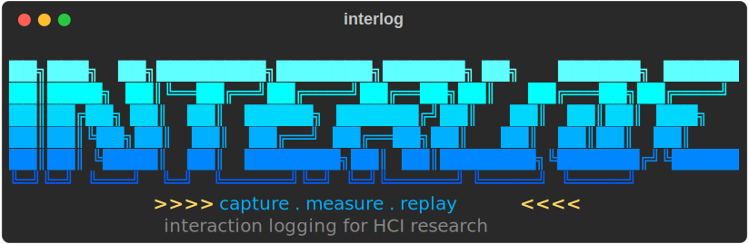
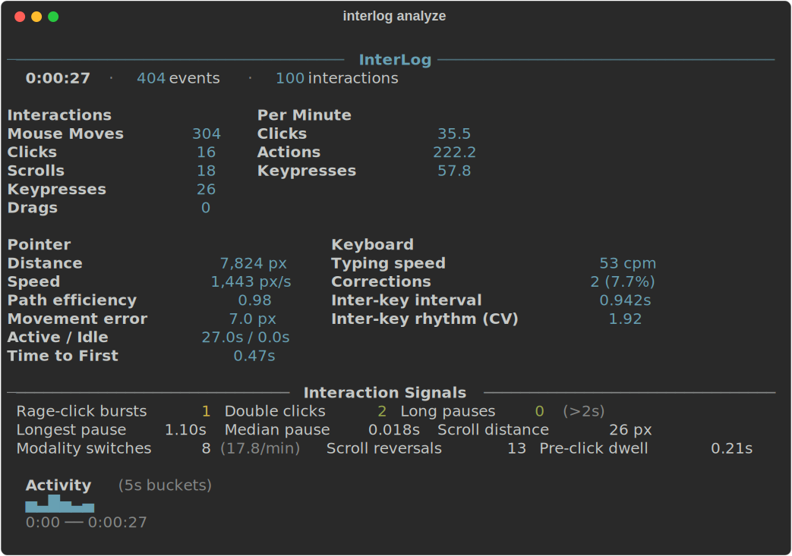
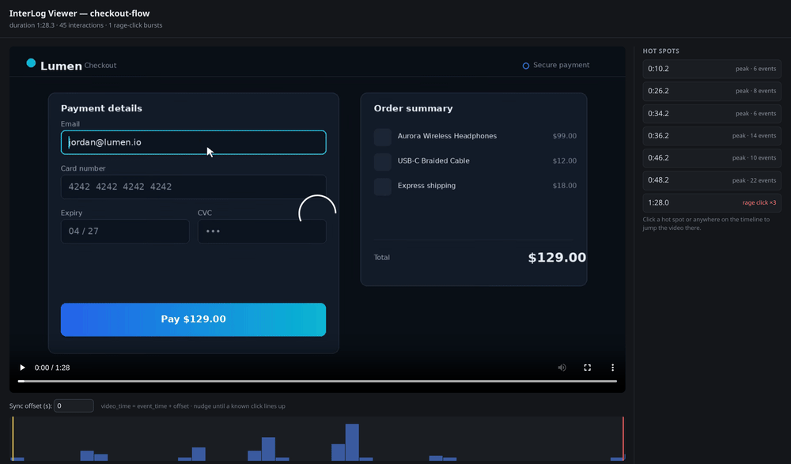
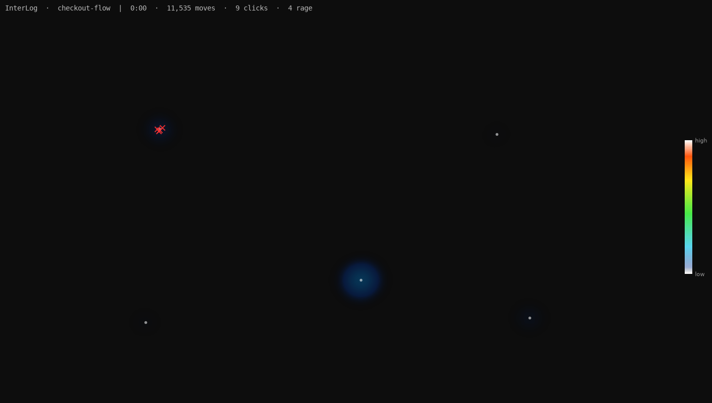
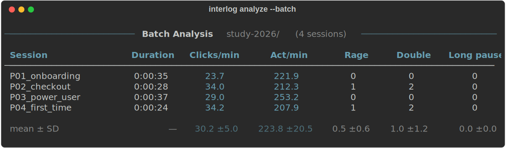
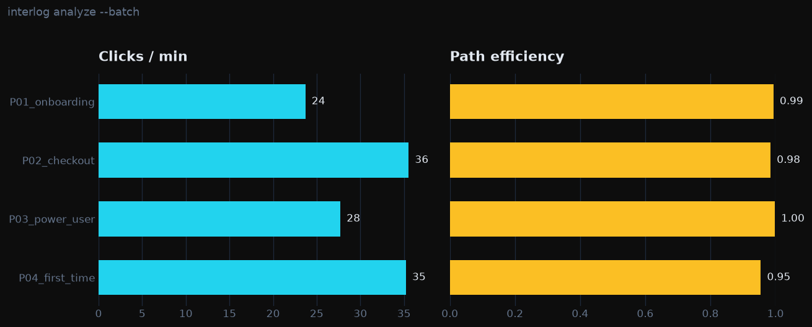
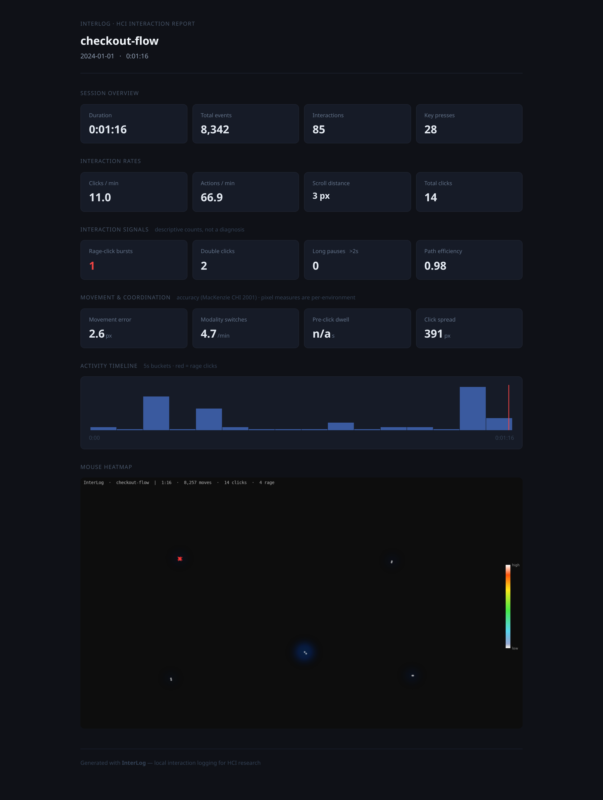

<div align="center">



**Local interaction logging and analysis for HCI research.**

[](https://github.com/blakepiper/interlog/actions/workflows/ci.yml)
[](https://www.python.org/)
[](LICENSE)

[Quick start](#quick-start) · [Commands](#commands) · [Output files](#output-files) · [Metrics](docs/METRICS.md) · [Privacy](#privacy--consent)

</div>

---

InterLog records timestamped keyboard and mouse activity, optionally captures the
screen, and turns a session into structured data you can query and compare —
instead of a video you have to watch end to end. It runs entirely on your machine:
no cloud, no accounts, no telemetry.

<p align="center">
  
  <br>
  <em><code>interlog analyze</code> turns one session into descriptive, literature-grounded metrics.</em>
</p>

> [!WARNING]
> **InterLog captures input globally, across every application — not just the
> window under study.** While recording, it logs every key you press and every
> mouse action *system-wide*, including anything you type into other apps
> (passwords, messages, unrelated windows). By default `interlog analyze` also
> reconstructs the typed text to `transcript.txt`. Record only what you intend
> to, get consent from participants, and use `--privacy` (and/or `--no-text`)
> for sensitive sessions. See [Privacy & consent](#privacy--consent).

## Why InterLog?

Screen recorders show you *what happened*. InterLog tells you *where it matters
and by how much*.

- **Data, not just pixels.** Every interaction becomes a CSV row you can query,
  aggregate, and compare across tasks, conditions, and participants.
- **An index into your video.** Jump straight to rage-click bursts and
  high-intensity hot spots via a synced timeline (`interlog view`).
- **Quantified behavior.** Clicks/min, action rate, pauses, scroll distance,
  pointer-path efficiency, rage-click detection — descriptive measures, not
  invented composite scores.
- **Visual summary.** A mouse-density heatmap overlaid on a captured screen frame
  (`interlog heatmap`).
- **Works anywhere on the desktop.** Native apps, prototypes, games, kiosks — not
  just websites, where Hotjar and Clarity stop.
- **Local, no telemetry.** Nothing leaves your machine. (Local storage isn't the
  same as participant privacy — capture is global, so see
  [Privacy & consent](#privacy--consent).)

Best fit: longer or repeated HCI/usability sessions where you need evidence and
triage, not a one-off clip.

## How It Compares

| | InterLog | Screen recorder / OBS overlay | Hotjar / Clarity | Morae | `user-test-logger` |
|---|---|---|---|---|---|
| Structured data (CSV/JSON) | ✅ | ❌ | ✅ (web only) | ✅ | ✅ |
| Works in native desktop apps | ✅ | ✅ | ❌ | ✅ | ❌ (Firefox only) |
| Screen + input sync | ✅ | overlay only | ✅ (web only) | ✅ | partial |
| Mouse heatmap | ✅ | ❌ | ✅ | ✅ | ❌ |
| Runs locally, no account | ✅ | ✅ | ❌ | ✅ | ✅ |
| Free & open source | ✅ | varies | ❌ | ❌ (discontinued) | ✅ |

The closest prior tools are worth naming honestly:

- **TechSmith Morae** was the native-desktop ancestor of this category —
  commercial, Windows-only, and discontinued in 2018 — pairing screen capture
  with synchronized input logging and marker-based analysis.
- **IBM's [`user-test-logger`](https://github.com/IBM/user-test-logger)** is the
  closest open-source analog, but it is scoped to a single Firefox browser
  session rather than the whole desktop.

What InterLog does differently: it is free, fully local, and works against **any**
native desktop application — not just a browser tab — while still exporting
structured, analysis-ready data.

## Quick Start

### Install

```bash
git clone https://github.com/blakepiper/interlog.git
cd interlog
pip install .
```

This installs a single `interlog` command on your PATH, along with everything
it needs — including the heatmap dependencies (matplotlib, numpy, Pillow).

Check your environment any time:

```bash
interlog doctor          # checks Python, pynput, ffmpeg, and heatmap deps
interlog doctor --live   # confirm input capture works (press ESC to stop)
```

### Try it without recording

Generate a realistic synthetic session and explore the outputs:

```bash
interlog demo                 # writes ./interlog-demo/demo
interlog analyze interlog-demo/demo
interlog demo --sessions 4    # a set for: interlog analyze --batch interlog-demo
```

Demo data is flagged `"synthetic": true` in its `metadata.json`, so it's never
confused with a real capture.

### Record a session

```bash
interlog record --name p01
# Press Ctrl+C when done
```

Each session is saved in its own subfolder:

```
interlog-data/
└── p01/
    ├── events.csv      # every interaction with timestamps
    └── metadata.json   # session info
```

Add `--screen` to also capture the primary display (requires
[ffmpeg](https://ffmpeg.org/download.html)):

```bash
interlog record --screen --name p01
```

### Analyze

```bash
interlog analyze interlog-data/p01
```

Prints a statistics panel and writes to the session folder:

- `summary.csv` — all metrics (clicks/min, rage clicks, path efficiency, …)
- `intensity.csv` — time-bucketed interaction counts
- `transcript.txt` + `text.json` — typed-text reconstruction and lexical stats
  (skipped in privacy mode; pass `--no-text` to disable)

### Heatmap, viewer, report

```bash
interlog heatmap interlog-data/p01          # mouse-density PNG, rage clicks in red
interlog view interlog-data/p01 --serve     # synced timeline; video auto-loads
interlog report interlog-data/p01           # shareable HTML report (embeds heatmap)
```

`--serve` starts a local HTTP server with Range-request support so the browser
seeks without downloading the whole file. Press Ctrl+C to stop it.

<p align="center">
  
  <br>
  <em><code>interlog view</code> — click a hot spot or the timeline and the recording jumps to that moment.</em>
</p>

<p align="center">
  
  <br>
  <em><code>interlog heatmap</code> — where the pointer dwelled, with clicks (white) and rage clicks (red).</em>
</p>

### Browse all sessions

```bash
interlog list
```

A table of every session: name, date, duration, event count, whether a screen
recording and analysis exist, and privacy status.

## Example Workflow

```bash
# 1. Record screen + interactions together
interlog record --screen --name p01

# 2. Analyze — statistics panel + output files
interlog analyze interlog-data/p01

# 3. Generate a heatmap PNG
interlog heatmap interlog-data/p01

# 4. Review with the synced viewer (video auto-loads, seeking works)
interlog view interlog-data/p01 --serve

# 5. Generate a shareable HTML report (embeds the heatmap)
interlog report interlog-data/p01

# After multiple sessions: cross-session table + aggregate.csv
interlog analyze --batch
```

Prefer your own recorder (OBS, QuickTime)? Record with it alongside
`interlog record`, then align the timestamps in the viewer's sync-offset field:

```bash
# Start your recorder, then:
interlog record --name p01
# Stop InterLog (Ctrl+C), then stop your recorder.
interlog view interlog-data/p01
```

## Commands

### `record` — Capture interactions

```
interlog record [OPTIONS]

  -n, --name NAME       Session name (default: timestamp)
  -o, --output DIR      Data directory root (default: ./interlog-data)
  -p, --privacy         Log key events without recording which keys
      --screen          Also record the primary screen via ffmpeg
      --fps N           Screen capture frame rate (default: 15)
      --monitor {primary,all}   Which display to capture (default: primary)
```

> `--monitor all` currently applies on Windows only; macOS and Linux capture the
> primary display.

### `demo` — Generate synthetic sample data

```
interlog demo [OPTIONS]

  -o, --output DIR      Output directory (default: ./interlog-demo)
      --sessions N      Number of varied sessions to generate (default: 1)
      --seed N          Random seed for reproducible data (default: 7)
```

Synthesizes realistic sessions (events + metadata, flagged `synthetic`) so you
can explore `analyze`, `view`, `report`, and `--batch` without recording.

### `list` — Browse sessions

```
interlog list [OPTIONS]

  -d, --dir DIR         Directory to list (default: ./interlog-data)
```

### `analyze` — Compute statistics

```
interlog analyze SESSION [OPTIONS]
interlog analyze --batch [DIR]

  SESSION               Session folder or path to events.csv
      --batch [DIR]     Aggregate all sessions in DIR (default: ./interlog-data)
  -o, --output DIR      Output directory (default: session folder)
  -b, --bucket-size S   Time bucket size for intensity (default: 5.0)
      --json            Also write summary.json (typed metrics + provenance)
      --no-text         Skip typed-text reconstruction
```

`--batch` prints a cross-session table (duration, clicks/min, rage clicks, long
pauses, path efficiency) with a mean ± SD row, and writes `aggregate.csv` to the
data directory.

<p align="center">
  
</p>

The same numbers, compared at a glance — `aggregate.csv` drops straight into a
plot:

<p align="center">
  
</p>

### `heatmap` — Generate a density PNG

```
interlog heatmap SESSION [OPTIONS]

  SESSION               Session folder or path to events.csv
  -o, --output FILE     Output PNG path (default: <session>/heatmap.png)
      --sigma N         Gaussian blur radius in pixels (default: 25)
      --frame-at PCT    Fraction into recording to grab background frame (default: 0.25)
      --no-open         Save without opening
```

Renders a mouse-movement density heatmap with click markers. A screen recording
(`recording.mp4`) in the session folder is used as the background when present.

### `view` — Open the synced timeline viewer

```
interlog view SESSION [OPTIONS]

  SESSION               Session folder or path to events.csv
  -o, --output PATH     Output HTML file or directory
  -b, --bucket-size S   Timeline bucket size in seconds (default: 2.0)
      --serve           Serve over HTTP so the recording loads automatically
      --no-open         Generate HTML without opening a browser
```

### `report` — Generate a shareable HTML report

```
interlog report SESSION [OPTIONS]

  SESSION               Session folder or path to events.csv
  -o, --output FILE     Output HTML path (default: <session>/report.html)
  -b, --bucket-size S   Activity chart bucket size in seconds (default: 5.0)
      --no-open         Write the report without opening it in a browser
```

A self-contained dark-themed HTML file: metric cards, an SVG activity bar chart
with rage-click markers, and the heatmap embedded as base64 (if `heatmap.png`
exists in the session folder). Everything is inline, so it works offline.

### `doctor` — Check your environment

```
interlog doctor [--live]

  --live   Run a live input-capture test (press ESC to finish)
```

## Output Files

### `events.csv`

One row per interaction:

| timestamp | event_type | x | y | button | key | dx | dy |
|-----------|------------|---|---|--------|-----|----|----|
| 0.125 | mouse_move | 450 | 320 | | | | |
| 0.891 | mouse_down | 450 | 320 | Button.left | | | |
| 1.023 | mouse_up | 450 | 320 | Button.left | | | |
| 1.445 | key_press | | | | a | | |
| 2.108 | scroll | 500 | 400 | | | 0 | -3 |

### `summary.csv`

| metric | value |
|--------|-------|
| session_duration_seconds | 127.45 |
| total_clicks | 45 |
| clicks_per_minute | 21.2 |
| rage_clicks_detected | 2 |
| double_clicks | 5 |
| long_pauses | 4 |
| total_mouse_distance_px | 18430 |
| mean_pointer_speed_px_s | 612 |
| mean_path_efficiency | 0.74 |
| time_to_first_interaction_seconds | 1.83 |
| typing_chars_per_minute | 142 |
| correction_rate | 0.08 |
| … | … |

Covers event counts and rates; pointer measures (distance, speed, path
efficiency, idle/active, time-to-first); movement accuracy (MacKenzie CHI 2001 —
error/variability/offset and direction-change counts); timing (longest/median
pause, long pauses); click signals (rage-click bursts, double clicks);
coordination (mouse↔keyboard switches, scroll reversals, pre-click dwell);
spatial spread of clicks; and keyboard dynamics (typing speed, inter-key interval
and rhythm, correction rate — identity-based ones omitted in privacy mode).

These are descriptive measures; InterLog deliberately does **not** fold them into
a single "struggle" or "frustration" index. **Path efficiency is comparable
across machines** — a dimensionless ratio (display scaling cancels) measured on a
trajectory resampled to a fixed time base, so it doesn't depend on the mouse's
native sampling rate. Raw pixel metrics (distance, speed) still scale with display
scaling and sampling rate, so compare those only across sessions from the same
machine — see `dpi_scale` in `metadata.json`.

> 📐 **[`docs/METRICS.md`](docs/METRICS.md)** defines every metric — formula,
> units, comparability, literature reference, and limitations — plus the
> event↔video sync model and its error budget.

### `summary.json` (with `--json`)

`interlog analyze --json` additionally writes a structured, self-describing
export for pulling results into pandas or R:

```json
{
  "schema": "interlog/summary",
  "schema_version": "1.0",
  "tool_version": "0.1.0",
  "session": {
    "name": "p01",
    "privacy_mode": false,
    "synthetic": false,
    "duration_seconds": 127.45,
    "provenance": { "interlog_version": "0.1.0", "system": "Darwin", "python_version": "3.12.1", "platform": "..." },
    "capture_region": { "width": 1920, "height": 1080, "dpi_scale": 2.0 }
  },
  "metrics": { "total_clicks": 45, "mean_path_efficiency": 0.74, "movement_error_px": 12.3, "...": "..." },
  "metrics_notes": { "comparability": "...", "nulls": "..." }
}
```

Unlike the CSV (every value stringified), it preserves native JSON types and
carries the session's provenance and a schema version, so a reader can interpret
the numbers and tell whether two sessions are comparable.

### `intensity.csv`

Time-bucketed interaction counts — useful for finding hot spots in long videos:

| time_start | time_end | total_interactions | clicks | scrolls | keypresses |
|------------|----------|--------------------|--------|---------|------------|
| 0.0 | 5.0 | 12 | 3 | 2 | 7 |
| 5.0 | 10.0 | 8 | 1 | 4 | 3 |
| 10.0 | 15.0 | 23 | 8 | 5 | 10 |

### `heatmap.png`

A mouse-movement density map overlaid on a screen grab from the recording, with
normal clicks in white and rage clicks in red. Generated by `interlog heatmap`.

### `report.html`

A self-contained HTML report with metric cards, an SVG activity timeline, and the
heatmap embedded as base64. Opens in any browser and screenshots cleanly.

<p align="center">
  
</p>

### `aggregate.csv`

Cross-session summary from `interlog analyze --batch`. One row per session;
columns match the key stats from `summary.csv`.

### `metadata.json`

```json
{
  "session_name": "p01",
  "start_time": "2024-01-15T14:30:00",
  "end_time": "2024-01-15T14:32:07",
  "privacy_mode": false,
  "provenance": { "interlog_version": "0.1.0", "system": "Darwin", "python_version": "3.12.1", "platform": "..." },
  "duration_seconds": 127.45,
  "total_events": 2341
}
```

With `--screen`, metadata also records the video filename, the event↔video
offset, the capture frame rate, and the `capture_region` (including `dpi_scale`).

## Analyze in Python or R

Every output is plain CSV/JSON, so results drop straight into your stats stack.
Aggregate a study and plot it in a few lines:

```python
import json, glob
import pandas as pd

# Per-session summaries (interlog analyze --json on each session)
rows = [json.load(open(f)) for f in glob.glob("interlog-data/*/summary.json")]
df = pd.json_normalize(rows, sep=".")[
    ["session.name", "metrics.clicks_per_minute", "metrics.mean_path_efficiency"]
]

# ...or just read the batch aggregate directly
agg = pd.read_csv("interlog-data/aggregate.csv")
agg.plot.barh(x="session", y="clicks_per_minute")
```

```r
# R
agg <- read.csv("interlog-data/aggregate.csv")
barplot(agg$clicks_per_minute, names.arg = agg$session, horiz = TRUE)
```

The `summary.json` schema version and `provenance` block let you check whether
two sessions are comparable before pooling them.

## What the Statistics Tell You

Descriptive signals to help you *triage* a recording — where to look first — not
validated measures of any mental state. Interpret them alongside the video.

**Rage-click bursts** — 3+ rapid clicks within a small area, counted once per
burst. An established UX-analytics signal often associated with a broken or
unresponsive target, or user confusion.

**Path efficiency** — straight-line distance between consecutive clicks divided
by the actual pointer path travelled (1.0 = perfectly direct). A standard
pointer-movement quality measure (MacKenzie, Kauppinen & Silfverberg, CHI 2001),
measured on a resampled trajectory so it's comparable across machines.

**Clicks per minute** — a baseline for comparison across tasks and participants.
Sudden drops often accompany dense reading or decision-making.

**Longest / long pauses** — gaps between actions. `long_pauses` counts inter-event
gaps over 2s; it carries no cognitive interpretation on its own.

**Interaction intensity** — the time-bucketed sparkline (terminal and
`intensity.csv`) tells you where to look first in a long recording.

## Privacy & consent

InterLog records keyboard and mouse input **globally**, using OS-level hooks. It
doesn't know or care which window has focus, so a session captures *everything*
typed and clicked while it runs — including content in unrelated applications
(browsers, password managers, chat).

- By default, `interlog analyze` reconstructs the keystrokes into a readable
  `transcript.txt` and keyword list. Pass `--no-text` to skip that step.
- `record --privacy` logs that keys were pressed without recording *which*, and
  suppresses text reconstruction. It does **not** redact mouse coordinates,
  keystroke timing, or the `--screen` recording, which captures whatever is on
  screen. Privacy mode and `--screen` together are contradictory for truly
  sensitive content.
- **Privacy mode redacts *which* key, not *when*.** The inter-key timing intervals
  stay in `events.csv`, and timing alone is a known side channel for inferring
  password length and structure. Treat the event log for any password-entry window
  as sensitive even in privacy mode; the cleanest protection is to not record
  through such moments at all.
- **Captured files are restricted to your user account.** On POSIX systems
  InterLog sets session folders to `700` and the files inside to `600` as they are
  written, so another user on a shared machine can't read them by default. This is
  defense-in-depth, not encryption — protect the data as you would any plaintext.
- **Antivirus / EDR may flag InterLog as a keylogger.** Global input capture trips
  generic keylogger heuristics regardless of intent or license. On a managed or
  corporate machine, expect endpoint security software to warn or quarantine it,
  and check with your IT department before installing.
- "Local-only" protects against *exfiltration*, not against capturing more than
  you intended. For studies with participants, obtain informed consent, follow
  your institution's ethics/IRB requirements, tell people the capture is
  system-wide, and have them close unrelated apps before recording.

## Technical Details

### Requirements

- Python 3.9+
- [`pynput`](https://github.com/moses-palmer/pynput) — installed automatically
- [`rich`](https://github.com/Textualize/rich) — installed automatically
- `matplotlib`, `numpy`, `Pillow` — installed automatically (used by `interlog heatmap`)
- `ffmpeg` — optional, needed only for `interlog record --screen`

### Platform Notes

**macOS** — Accessibility permission required:
System Settings → Privacy & Security → Accessibility → add your terminal.

**Linux X11** — No extra steps needed.

**Linux Wayland** — ⚠️ input capture (mouse/keyboard) does not work under
Wayland compositors (GNOME, KDE Plasma, etc.). This is not an InterLog bug —
Wayland's security model intentionally prevents any background process from
observing global input events, unlike X11 or the OS-sanctioned APIs on macOS
(Accessibility) and Windows. `interlog doctor --live` will report zero events
captured. `--screen`-only recording (no interaction log) may still work via
xdg-desktop-portal + PipeWire, but portal negotiation is flaky in practice on
some distros/compositor versions and isn't guaranteed. If you're on Wayland,
run `interlog doctor` first — if it reports capture is broken, either switch
your session to X11 (available on most distros at the login screen) or use
InterLog on macOS/Windows instead.

**Windows** — Works out of the box on Windows 10+.

## Use Cases

- **Usability testing** — locate pain points and confusion with quantified evidence
- **A/B testing** — compare interaction patterns between design conditions
- **User research** — supplement qualitative observation with behavioral metrics
- **Academic HCI** — publish reproducible interaction data alongside findings

## FAQ

**Does this record my screen?** Optionally. By default InterLog captures only
mouse/keyboard events. Add `--screen` to also record the display via ffmpeg,
time-aligned with the event log, then use `interlog view --serve` for the synced
viewer. You can also bring your own recorder and align with the sync-offset field.

**Is my data sent anywhere?** No. Everything stays on your machine — no network
access, no cloud, no telemetry.

**Can I use this for remote research?** Yes. Send participants the package, have
them run `interlog record` locally, and share the session folder afterward.

**What about mobile/touch?** Not supported. InterLog targets desktop mouse and
keyboard.

**How accurate are the timestamps?** Sub-millisecond resolution from a monotonic
clock — accurate enough to sync with 60fps video.

## Contributing

Contributions are welcome — see [CONTRIBUTING.md](CONTRIBUTING.md) for setup and
guidelines. Found a bug or have an idea?
[Open an issue](https://github.com/blakepiper/interlog/issues). Code? Fork and
submit a PR.

## License & Citation

InterLog is free and open-source under the [MIT License](LICENSE). If you use it
in published research, please cite it — see [CITATION.cff](CITATION.cff).

## Acknowledgments

Built with [pynput](https://github.com/moses-palmer/pynput) for cross-platform
input monitoring and [Rich](https://github.com/Textualize/rich) for terminal
output.
